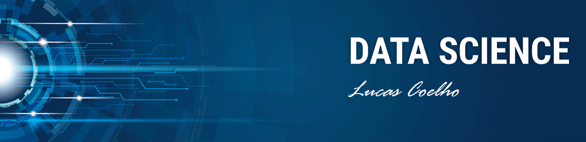

   

  

# Lucas Coelho
**Data Analyst at UPS**

Hi there! Thanks for visit my profile! I introduce myself as an engineer with more than 10 years of experience in Data Analysis and Industrial Processes. 

During my journey, I've worked with many statistics analysis, continuous improvement and making dashboards to the managers, developing a critical thinking and problem-solving skills. I always believed in a improvement culture and in my learning carreer I realized that the decisions made from a data analysis becames it much more accurate!

So, I've discovered the Data Science's World and it's infinities tools. My graduation as IT Tecnician helped me a lot in the beginning, but I'm sure that the apprenticeship is continuous and there are a lot of information to learn. I'm consider myself like a born lifelong learner!

I'm looking for contribute to the Data Driven Culture because I believe in a blend with some important concepts of the Lean Manufacturing metholodogy can be so powerfull to change a business level.

I try to be very assertive and inspiring in my comunication, because I really believe the people make the diference in all of this changing process, and this have a direct impact, not just in the business enviroment, but also in the final client experience. Nowadays I'm studying some of the main tools in the market, basides that some key-topics like Agile Methodologies, Machine Learning Alghorithms, Deep Learning and PLN. 

* **Background in:** Python, R, Excel, Power BI and Machine Learning. 
* **Currently studying about:** Neural Networks, Machine Learning and Robotic Process Automation

**Links:**
* [LinkedIn](https://www.linkedin.com/in/lucas-tcoelho/)
* [Medium](https://medium.com/@lucastouzopro)

## Projects:

* **Exploratory Analysis with data from Brazilian's COVID-19 Vaccination Program:** 

---
